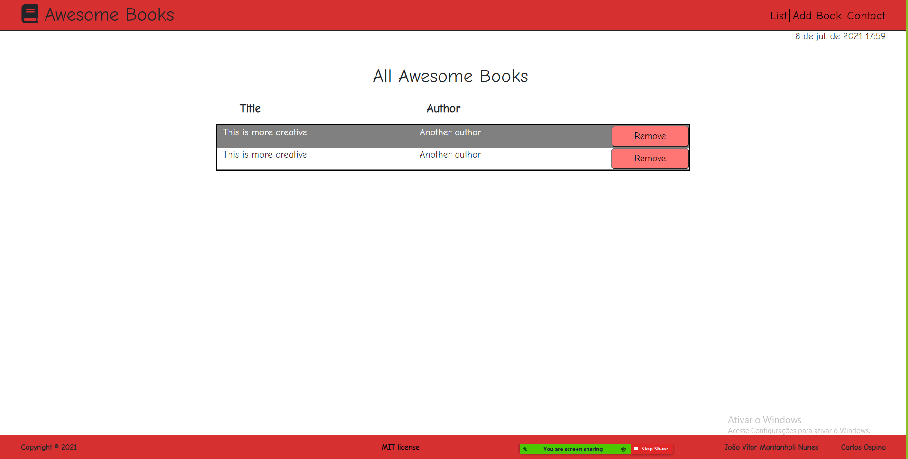

# Project Awesome Books

> Awesome Books in JavaScript is a practice project, which includes the user input functionality and managing the dynamically DOM manipulation with Local Storage. We used Javascript, HTML5, CSS3.

Additional description about the project and its features.

## Built With

- Javascript
- Html/Css
- Git
- Github
- VsCode

## Live Demo

[Live Demo Link](https://jmontanholi.github.io/AwesomeBooks-Joao-Carlos/)

## Getting Started

To get a local copy up and running follow these simple example steps.

### Prerequisites
- Browser
- Text Editor (VSCode is suggested.)
- Git installed 

### Setup
- Open Terminal
- In your prefered folder, run `git clone https://github.com/jmontanholi/AwesomeBooks-Joao-Carlos.git`
- Open the `index.html` in the folder to run the project

### Usage
-Fill the form inputs with your information, and press the Submit and you'll be able to see the book list. Later on you could remove a book from the list with the remove button.

## Authors

👤 **João Vítor Montanholi Nunes**

- GitHub: [jmontanholi](https://github.com/jmontanholi)
- Twitter: [MontanholiNunes](https://twitter.com/MontanholiNunes)
- LinkedIn: [Joao vitor montanholi](https://www.linkedin.com/in/joaovitormontanholi/)

👤  **Carlos Ospina**

- GitHub: [@carloso0114](https://github.com/carloso0114)
- LinkedIn: [Carlos Ospina](https://www.linkedin.com/in/carlosospina/)

## 🤝 Contributing

Contributions, issues, and feature requests are welcome!

Feel free to check the [issues page](https://github.com/jmontanholi/AwesomeBooks-Joao-Carlos/issues).

## Show your support

Give a ⭐️ if you like this project!

## Acknowledgments

- Microverse 
- W3 School 

## 📝 License

This project is [MIT](./MIT.md) licensed.
